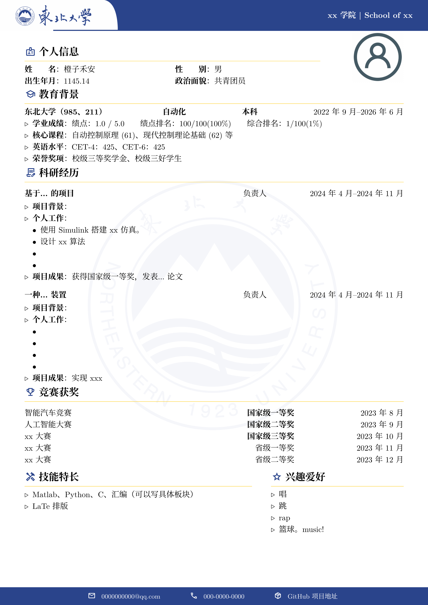

# NEU-CV：东北大学 LaTeX 中文简历模板

## 简介

本模板基于：

- [SEU 中文 CV 模板](https://www.overleaf.com/latex/templates/seu-cv-dong-nan-da-xue-latex-zhong-wen-jian-li-mo-ban/jyzpthvnbmpm)

修改内容如下：
- 解决了中文无法换行的问题
- 证件照修改为全局位置调整，使用更加灵活
- 增加了tabularx对主题内容进行处理
- 更改了行间距、字体等，可以书写更多正文
- 调整了图案、颜色、风格等

## 使用方法

- 编辑 `main.tex` 中的内容，对文档样式和内容进行修改。
- 使用 `XeLaTeX` 或 `LuaLaTeX` 编译。
